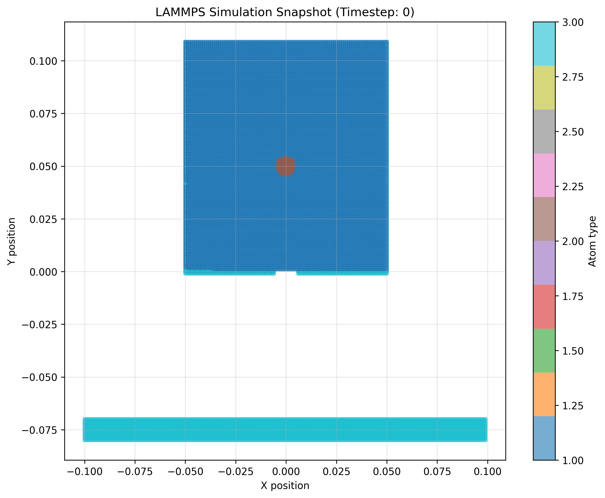
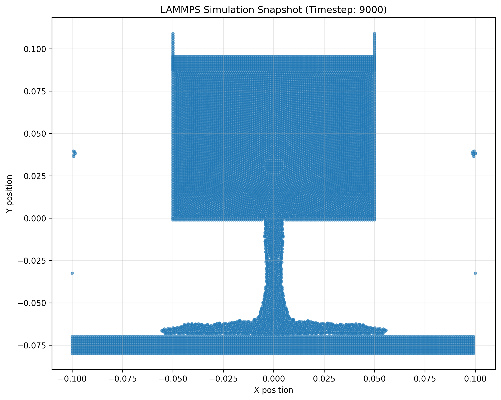
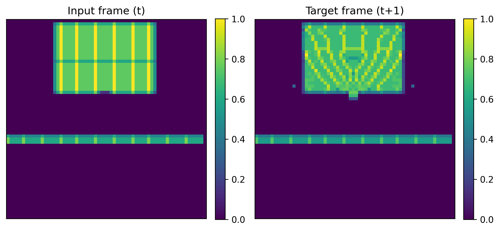
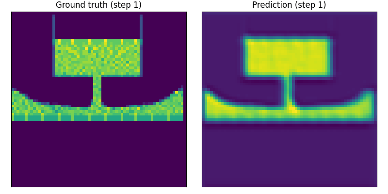

# Frame Prediction with LAMMPS Simulation Data

This project focuses on predicting the next frame in a molecular dynamics simulation using machine learning. The goal is to learn the dynamics from LAMMPS simulation data.

## Project Structure

```
ML_project1/
├── data/                   # LAMMPS dump files
├── src/                    # Source code
│   └── explore_data.py     # Data exploration and visualization
│   └── visualize_grid.py   # Visualize grid data
│   └── train_cnn.py        # Train a CNN for frame prediction
│   └── predict_sequence.py # Predict a sequence of frames
│   └── make_video.py       # Make a video from the predicted frames
├── output/                 # Output files and visualizations
│   └── visualization_dump.0.png
│   └── visualization_dump.9000.png
│   └── grid_sample_train_0.png
│   └── grid_sample_train_9000.png
│   └── prediction_vs_gt.gif
├── requirements.txt        # Python dependencies
└── README.md               # This file
```

## Setup

1. Create a virtual environment (recommended):
   ```bash
   python -m venv venv
   source venv/bin/activate  # On Windows: venv\Scripts\activate
   ```

2. Install dependencies:
   ```bash
   pip install -r requirements.txt
   ```

## Getting Started

1. First, explore the data:
   ```bash
   python src/explore_data.py
   ```
   This will:
   - Scan the data directory for LAMMPS dump files
   - Display basic information about the first and last frames
   - Generate visualizations in the `output` directory

## Next Steps

1. **Inspect the visualizations** in the `output` directory to understand the data
2. **Modify `explore_data.py`** to explore different aspects of the data
3. **Create a data loader** to prepare the data for training
4. **Implement a simple model** for frame prediction

## Data Format

The data consists of LAMMPS dump files in the `data` directory. Each file represents a snapshot of the simulation at a specific timestep.

## Demo

This section provides a visual walkthrough of the project pipeline, from raw LAMMPS data to trained model predictions.

### 1. Raw LAMMPS Data

We start with LAMMPS dump files containing particle positions over time. Here are visualizations of the first and last frames:

#### Initial Frame (t=0)


#### Frame at t=9000


### 2. Data Preprocessing

#### Rasterization to 2D Grid
We convert the 3D particle positions into 2D density maps for processing with CNNs:


*Left: Input frame (t), Right: Target frame (t+1)*

### 3. Training the CNN

We train a simple CNN to predict the next frame given the current one. The training progress looks like this:

```
Epoch 01 | train_loss=0.123456 | val_loss=0.098765
Epoch 02 | train_loss=0.098765 | val_loss=0.087654
...
```

### 4. Predictions


*Left: ground truth, Right: predicted frame*

Predicted frame resembles a fading shadow.

Future work will focus on swapping out CNNs for GNNs, RNNs and PINNs.

### How to Reproduce

1. Install dependencies:
   ```bash
   pip install -r requirements.txt
   ```

2. Generate visualizations:
   ```bash
   python src/explore_data.py
   python src/visualize_grid.py
   ```

3. Train the model:
   ```bash
   python src/train_cnn.py
   ```

4. Generate predictions:
   ```bash
   python src/predict_sequence.py
   ```

5. Generate video:
   ```bash
   python src/make_video.py
   ```

## License

This project is for educational purposes.
