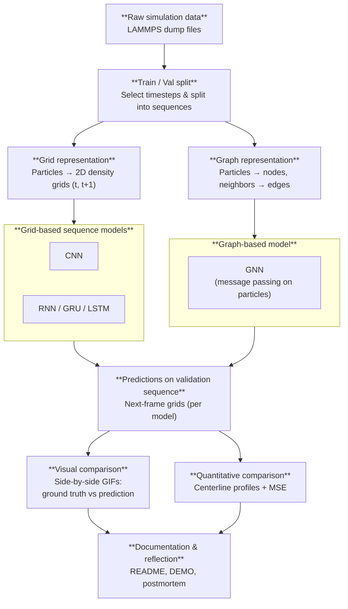

```mermaid
flowchart TD

    %% Data source
    A["**Raw simulation data**<br/>LAMMPS dump files"] 

    %% Split
    A --> B["**Train / Val split**<br/>Select timesteps & split into sequences"]

    %% Two parallel representations
    B --> C["**Grid representation**<br/>Particles → 2D density grids (t, t+1)"]
    B --> D["**Graph representation**<br/>Particles → nodes, neighbors → edges"]

    %% Models
    subgraph E[**Grid-based sequence models**]
        E1["CNN"]
        E2["RNN / GRU / LSTM"]
    end

    C --> E

    subgraph F[**Graph-based model**]
        F1["GNN<br/>(message passing on particles)"]
    end

    D --> F

    %% Unified prediction & evaluation
    E --> G["**Predictions on validation sequence**<br/>Next-frame grids (per model)"]
    F --> G

    G --> H["**Visual comparison**<br/>Side-by-side GIFs:<br/>ground truth vs prediction"]
    G --> I["**Quantitative comparison**<br/>Centerline profiles + MSE"]

    %% Reflection / docs
    H --> J["**Documentation & reflection**<br/>README, DEMO, postmortem"]
    I --> J
```
